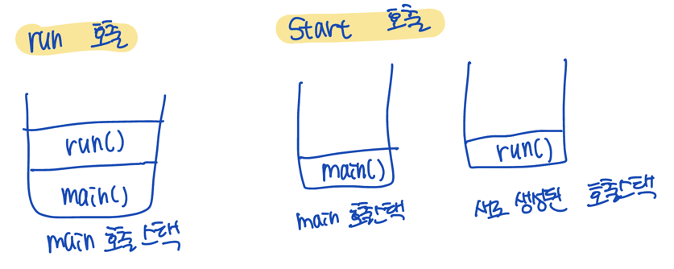

# 각 요구사항별 학습 내용 정리
* 구현 단계에서는 각 요구사항을 구현하는데 집중한다. 
* 구현을 완료한 후 구현 과정에서 새롭게 알게된 내용, 궁금한 내용을 기록한다.
* 각 요구사항을 구현하는 것이 중요한 것이 아니라 구현 과정을 통해 학습한 내용을 인식하는 것이 배움에 중요하다. 

## ch 3, 4 공부 내용

### 우리의 서버 기본 동작
1. WebServer.main : 사용자의 요청이 올 때까지 while 문을 돌며, listen() 하고 있는다.
2. 사용자의 요청이 오면, RequestHandler(Thread) 를 start() 한다.

### Thread 의 run() 과 start()
🤔 처리로직은 run()에 있는데, 왜 run() 이 아니라 start() 호출하나요?
- Thread 의 동작 방식을 알아야 한다!

#### `start()` 와 `run()` 의 차이와 쓰레드가 실행되는 과정
- `run()` : 생성된 쓰레드를 실행하는 것이 아니라, 단순히 클래스에 선언된 메서드를 호출
- `start()` : 새로운 쓰레드 작업에 필요한 호출 스택(call stack)을 생성하고 다음에 run 호출하여, 생성된 호출 스택에 run() 이 첫 번째로 올라오도록 함

즉, run() 은 그냥 메서드 호출이고, start() 는 호출 스택도 생성하고 그 다음 run() 까지 실행하여 run() 은 새로 생성된 호출 스택에 적재되는 것!

[그림 예시]



### Thread VS Runnable

쓰레드에는 구현 방법이 2가지가 있다!

1️⃣ Thread 클래스를 상속(extends)받는 방식
- Thread 클래스의 run() 을 오버라이딩

2️⃣ Runnable 를 구현(implements)하는 방식
- Runnable 인터페이스의 run() 을 구현

두 가지 방법의 인스턴스 생성 방법의 차이가 있다!

| 방법                        | 인스턴스 생성 방법                                                                                                                                                                                                              |
|:--------------------------|:------------------------------------------------------------------------------------------------------------------------------------------------------------------------------------------------------------------------|
| `Thread` 클래스 `extends`        | Thread 의 자손 클래스의 인스턴스 생성                                                                                                                                                                                                |
| `Runnable` 인터페이스 `implements` | 1. Runnable 인터페이스를 구현한 클래스의 객체(인스턴스) 생성<br/>2. Thread 객체를 만들 때 Runnable 객체를 생성자의 인자로 넘긴다.<br/>3. Thread의 run()을 직접 호출하는 게 아니라, Runnable 객체의 run()이 실행됨.<br/>4. _**Thread를 상속받지 않고**_ Runnable을 구현한 객체를 외부에서 전달받아 실행 가능! |

#### 🤔 왜 Runnable 방식을 사용하는 것이 더 좋을까?

결론적으로는 Runnable 가 유연성, 유지보수성, Testability 때문에 더 좋다!

1️⃣ Thread 방식은 단일 상속의 한계가 있음(유연성)
- Java 는 단일 상속만 지원하기 때문에, 다른 클래스를 상속할 수 없음
- Runnable 은 implements 이므로, 다른 상속을 받으면서 멀티스레드를 사용할 수 있다!

2️⃣ Runnable 을 사용하면 코드 분리가 쉬워짐(유지보수성)
- Thread 를 상속받으면 run() 메서드와 스레드 실행 로직이 한 클래스에 섞이게 됨.
- 반면, Runnable 을 사용하면 스레드의 실행 로직을 별도 객체로 분리할 수 있음

[코드 예시]
```java
class MyThread extends Thread {
    @Override
    public void run() {
        System.out.println("Thread 실행 중...");
    }
}
```
- Thread 자체에 실행 로직이 포함됨 → 객체 간 역할이 명확하지 않음.

```java
class MyRunnable implements Runnable {
    @Override
    public void run() {
        System.out.println("Runnable 실행 중...");
    }
}

public class Main {
    public static void main(String[] args) {
        Runnable r = new MyRunnable();
        Thread t = new Thread(r);
        t.start();
    }
}
```
- Thread 의 역할 : 단순히 Runnable 을 받아 실행하는 역할만 수행. 
- Runnable 의 역할 : 실행할 작업을 정의.

3️⃣ 테스트 용이성 증가(Testability)
- Thread 를 상속받으면, 실행 로직과 스레드 실행이 결합되어 테스트하기 어려움.
- Runnable 을 사용하면 별도로 실행 로직을 분리하여 단위 테스트 가능.

#### 🤔 그럼 Runnable 은 한계가 없나?
1. 지나치게 저수준 API(쓰레드의 생성)에 의존
2. 값의 반환 불가능
3. 매번 쓰레드 생성과 종료하는 오버헤드 발생
4. 쓰레드 관리 어려움

쓰레드를 어떻게 만드는지는 애플리케이션을 만드는 개발자의 관심사와 거리가 멀다.<br>
그리고 쓰레드의 작업이 끝난 후 결과 값을 반환받는 것도 불가능하고, 쓰레드를 사용할 때 생성하고 종료하는 오버헤드가 발생한다.<br>

> 그래서 `Executor`, `ExecutorService`, `ScheduledExecutionService` 와 `Callable`, `Future` 이 등장! 

출처 : https://mangkyu.tistory.com/259 [MangKyu's Diary:티스토리]<br>
출처 : 자바의 정석 p.724 ~ p.726

### Callable, Future 및 Executors, Executor, ExecutorService, ScheduledExecutorService
> 강의 다 듣고 정리할 예정!

출처 : https://mangkyu.tistory.com/259 [MangKyu's Diary:티스토리]<br>
출처 : 정수원, 인프런 강의, 자바 동시성 프로그래밍 [리액티브 프로그래밍 Part.1]

### static 정리

#### 👏 먼저 자바 메모리 구조부터 살펴보자
- 자바 메모리 구조는 메서드 영역, 스택 영역, 힙 영역이 있다.
  - 메서드 영역 : 프로그램을 실행하는데 필요한 공통 데이터를 관리한다. 이 영역은 프로개름의 모든 영역에서 공유
    - 클래스 정보, static 영역, 런타임 상수 풀(프로그램을 실행하는데 필요한 공통 리터럴 상수)
  - 스택 영역 : 자바 실행 시, 하나의 실행 스택이 생성됨. 각 스택 프레임은 지역 변수, 중간 연산 결과, 메서드 호출 정보 등을 포함
    - 스택 프레임 : 스택 영역에 쌓이는 박스라고 생각하면 됨. 메서드를 호출할 때마다 하나의 스택 프레임이 쌓이고, 메서드 종료되면 해당 스택 프레임 제거됨
  - 힙 영역 : 객체(인스턴스)와 배열이 생성되는 영역. 가비지 컬렉션(GC)이 이루어지는 주요 영역, 더 이상 참조되지 않는 객체는 GC에 의해 제거됨

(참고) 스택 영역은 정확히 말하면 쓰레드 별로 하나씩 생성됨!

- 자바에서 특정 클래스로 100개의 인스턴스를 생성하면, 힙 메모리에 100개의 인스턴스가 생기고, 각각의 인스턴스는 내부에 변수와 메서드를 가짐
- 하지만, 여기서 메서드는 공통된 코드를 공유하므로, 인스턴스가 생성될 때, 인스턴스 변수는 메모리가 할당되지만 메서드에 대한 새로운 메모리 할당은 없음
- 메서드는 메서드 영역에서 공통으로 관리되고 실행됨
- 만약, x001(인스턴스 참조값).method() 호출한다고 하면 힙 영역에서 x001 값을 가진 인스턴스를 찾고, 그 인스턴스가 생성된 클래스를 메서드 영역에서 찾아서 method() 호출한다!

#### static 변수
- 멤버 변수에 static 을 붙이게 되면 static 변수, 정적 변수, 클래스 변수라고 칭함
- static 이 붙은 멤버 변수는 메서드 영역에서 관리함
  - static 이 붙은 멤버 변수는 인스턴스 영역에 생성되지 않고, 메서드 영역에서 관리함
- static 변수는 자바 프로그램을 시작할 때 딱 1개 만들어짐. 보통 여러곳에서 공유하는 목적으로 사용됨
- 생명주기는 지역 변수(매개 변수 포함), 인스턴스 변수, 클래스 변수 중에 클래스 변수가 가장 긴 생명주기를 가진다.
  - static 이 정적이라는 이유가 여기있는데, 힙 영역에 생성되는 인스턴스 변수는 동적으로 생성되고 제거되는 반면, 정적 변수는 프로그램 실행 시점에 딱 만들어지고, 프로그램 종료 시점에 제거된다. 이름 그대로 정적인 것
- 정적 변수에 접근할 때는 `클래스명.변수명` 이렇게 누가봐도 정적 변수임을 알 수 있도록 하는게 좋다.

#### static 메서드
- 메서드에 static 을 붙이게 되면 정적 메서드 또는 클래스 메서드라고 한다.
- ✅ static 메서드는 static 만 사용할 수 있다.
  - 정적 메서드는 static 이 붙은 정적 메서드나 정적 변수만 사용할 수 있음(안그럼 컴파일 오류 생김)
    - 정적 메서드는 클래스의 이름을 통해 언제든 바로 호출할 수 있음. 메서드 영역에서 바로 호출되므로, 인스턴스처럼 참조값 개념이 없음
    - 특정 인스턴스의 기능을 사용하려면 참조값을 알아야 하는데, 정적 메서드는 참조값 없이 호출되므로 사용할 수 없는 것
    - 아무 정보도 없이 힙 영역에서 어떤 인스턴스를 조회하는 것은 불가능한 것이다!
    - 객체의 참조값을 매개변수로 전달하면 정적 메서드로 인스턴스 변수, 메서드 사용 가능함
- ✅ 정적 메서드 활용
  - 객체 생성 없이 메서드 호출만으로 필요한 기능을 수행할 때 주로 사용
    - 간단한 메서드 하나로 끝나는 유틸리티성 메서드에서 자주 사용
    - 예) 우리 과제에서 나온 HttpRequestUtils

#### static import
- 정적 메서드를 사용할 때 자주 호출해야 한다면 static import 로 편리하게 사용 가능하다.
- `import static 클래스명.static 함수명` : 특정 정적 메서드 하나만 사용하려면 이렇게 선언해주면 `클래스명.함수명`으로 안하고, `함수명`으로만 사용 가능하다!
- `import static 클래스명.*` : 특정 클래스의 모든 정적 메서드에 클래스명 생략을 적용하려면 * 를 사용하면 된다!
- static import 는 정적 변수에도 사용 가능하다

#### main() 메서드는 정적 메서드
- 인스턴스 생성 없이 실행하는 가장 대표적인 메서드가 main()

### ⚙️ 트러블슈팅

#### 요구사항 3 - post 방식으로 회원가입

* POST 리퀘스트 바디를 `br.readLine()`으로 읽어올 때 무한로딩 걸리는 오류
  
  → `readLine()` \n 를 만나야 한 줄이라고 인식함</br>
  → \n 가 없으면 끝이 아닌 줄 알고 계속 읽었던 것
  
  **해결 방법**
  
  IOUtils 에 있던 readData 를 사용하니 해결됨. 여기서는 헤더에 있는 contentLength 정보를 이용해서 읽어옴

## ch 5 공부 내용

### 리팩터링 - HttpServletRequest 분석
- 리팩터링할 때 스프링에서는 HttpRequest 를 어떻게 처리하는지 궁금해서 찾아보았다.

#### 일단, HttpServletRequest 인터페이스를 어떤 구현체가 구현하고 있을까?
- WAS 마다 다른데, 톰캣 서버를 사용하는 경우에는 기본 구현체가 RequestFacade 이다(물론 Facade 패턴이므로 실제 구현체는 Request 이다)
  - `org.apache.catalina.connector.Request` 에 실제 구현 로직이 있고, `package org.apache.catalina.connector.RequestFacade` 가 Request 를 사용한다.
- 기본적으로 우리가 톰캣 서버를 사용하면, 사용하는 구현체는 RequestFacade 인 것!

#### 그럼 HttpServletRequest 에는 대략적으로 어떤 기능이 있을까?
- 일단, 실제 인터페이스는 매우매우 복잡하므로 우리가 구현해야 하는 기능들만 대략적으로 살펴보면
  - getCookies, getHeader, getQueryString, getRequestURI, getRequestURL 이 있다.
- 즉, HttpRequest 는 저런 정보들을 사용할 수 있도록 구현되면 된다!

#### 🤔 그럼 HttpRequest 파싱같은 건 어디서 하는거지?

전체 동작 과정을 정리해보자
1. Client HTTP 요청 보냄
2. Tomcat 이 요청 받아서 `ThreadPoolExecutor` 의 스레드 실행(run())
3. run() 내부에서 Worker.run() 을 실행 -> task.run()이 실행되는데, 이 task.run() 은 내부에서 Http11Processor service 를 실행한다
4. 그리고 Http11Processor.service() 내부에서 Request, Response 객체를 생성하는 것. 즉, 여기서 요청을 읽는 과정이 일어나는 것. 그리고 Spring MVC 로 전달한다.
   - service() 대략적인 로직 : 더 자세한 로직을 보고 싶으면, `org.apache.coyote.http11.Http11Processor` 여기 코드 보기!
    ```java
    // 요청 읽기
    parseRequestLine();
    parseHeaders();
    
    // 요청 처리
    getAdapter().service(request, response);
    
    // 응답 전송
    outputBuffer.commit();
    ```
5. Spring 의 `DispatcherServlet`이 Controller 실행
6. 결과를 Response 객체에 담아 Http1Processor.service() 에 있는 outputBuffer.commit() 으로 응답 반환
7. Client 는 응답 받음

> 즉, Tomcat 에서 HTTP 요청을 파싱하고, 그 결과로 HttpServletRequest 를 생성하고 결과를 담은 HttpServletResponse 객체를 생성하여 SpringMVC 에 전달하는 것 

#### (번외) Tomcat vs Jetty 등 WAS 내용 정리
- HttpServletRequest 분석하면서 어디까지가 tomcat 에서 처리하는 것이고, 어디서 Spring MVC 로 넘어오는지 궁금하여 알아보았다.

#### (번외) ParameterMap VS ConcurrentHashMap VS HashMap
- HttpServletRequest 분석하면서 Map 이 다양한 구현체를 가진다는 것을 알고, 알아보았다.

### 리팩터링 - Spring MVC 구조
- 리팩터링할 때 스프링의 FrontController 개념을 배웠던 기억이 나서 정리해보았다.


### 리팩터링 - 401 코드에서 302 코드로

|상태 코드| 	의미	              | 클라이언트 동작                                   |
|:---|:------------------|:-------------------------------------------|
|401 Unauthorized| 인증이 필요함 (로그인 안 됨) | 클라이언트가 직접 로그인 페이지로 이동하거나 로그인 요청을 다시 시도해야 함 |
|302 Found      | 서버가 로그인 페이지로 리다이렉트| 브라우저가 자동으로 로그인 페이지로 이동함|           

- 로그인 실패와 접근 권한이 없을 때는 401이라고 생각함
- 401은 클라이언트가 잘못된 인증 정보를 보냈다는 의미로 자동으로 리다이렉트 하지 않고, 클라이언트가 다시 로그인 요청을 보내도록 유도하는 상태 코드(의미 전달 용도)
- 302는 서버에서 잘못된 인증 정보를 보냈다고 바로 로그인 화면으로 보내는 상태 코드(서버가 직접 재로그인 실행)

즉, 서버와 프론트가 통신하지 않고, 함께 있는 현 상태에서는 302를 쓰는 것이 더 적합하다고 생각함

### 리팩터링 - Response 객체와 viewResolver

### @Value

### ByteArrayOutputStream 정리

### 테스트코드 라이브러리 정리

`org.hamcrest.coreMatchers.*`
`org.junit.Assert.*`

### HttpServletResponse

### URL VS URI
- 정리할 예정

[출처](https://inpa.tistory.com/entry/WEB-%F0%9F%8C%90-URL-URI-%EC%B0%A8%EC%9D%B4)

### abstractController

### ✅ Home, Html, CSS 컨트롤러까지 만든 이유

### StringBuilder vs `+` 연산자
- Cookie 를 응답에 반영하는 과정에서 StringBuilder 를 사용하라는 인텔리제이의 추천이 있어 알아봤다.

### 내부클래스
- RequestLine 과 Header 를 내부 클래스로 변경하였는데, 내부 클래스는 보통 언제 쓰이는지 궁금해서 알아봤다.

### css 는 text/css 를 설정해야 하는데, js 는 text/javascript 안해도 되는이유?

### Adapter 패턴 추가한 이유
- Adapter 패턴은 서로 다른 인터페이스를 가진 클래스들을 연결해주는 디자인 패턴
- Controller 가 다른 형태인 것으로 사용하고 싶을때는 그냥 요청 uri 에 맞는 Controller 를 바로 호출하는 경우에는 변경 사항이 아주 많아진다.
- 그래서 Adapter 라는 중간 형태를 두어 요청마다 다른 컨트롤러를 사용하고 싶을 때, Controller 가 담겨있는 map 에서 데이터 한줄만 바꿔주면 되는 것이다!
```java
    private void initHandlerMappingMap() {
        handlerMappingMap.put("/user/login", new AnotherUserLoginController());
        handlerMappingMap.put("/user/create", new UserSaveController());
        handlerMappingMap.put("/user/list", new UserListController());
        handlerMappingMap.put("/", new HomeController());
        handlerMappingMap.put("/css", new CssController());
        handlerMappingMap.put("/html", new HtmlController());
    }
```
- 그럼 Adapter 가 알아서 알맞은 Controller 타입으로 바꿔주고, 바로 사용된다!

### ⚙️ 트러블슈팅

#### Tomcat `/hello` 404 오류
- tomcat 서버가 실행되면, 기본 루트 경로에서 `WEB-INF/classes` 에서 실행할 것을 찾는다.
- 이것이 설정이 안되어 있어서 난 오류

#### JSP 없다는 오류
- tomcat 서버를 사용하려면 JSP 도 같이 build.gradle 에 implementation 해줘야 한다.