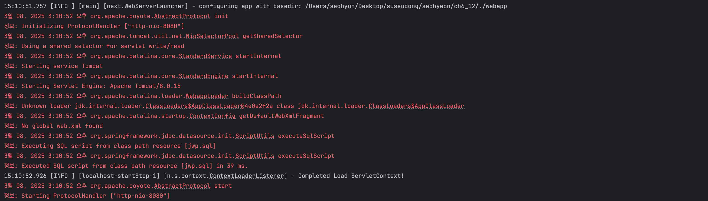
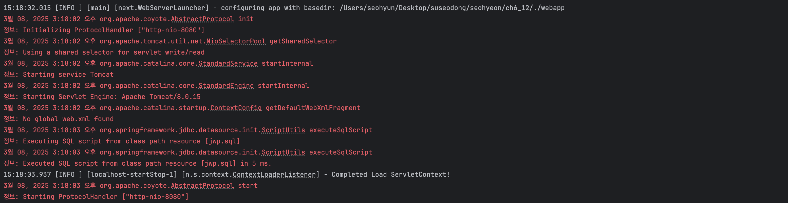

## 6장 : 서블릿/JSP를 활용해 동적인 웹 애플리케이션 개발하기

### 서블릿과 JSP

동적으로 데이터를 보여주기 위해 자바 코드에서 html을 생성하면 소스 코드가 매우 복잡해지고, 로직과 뷰의 분리도 어렵다. 이런 서블릿의 한계를 극복하기 위해 등장한 게 **JSP**이다.

JSP는 정적인 HTML은 그대로 두고 동적으로 변경되는 데이터만 JSP 구문을 활용해서 넣어준다. JSP 초기에는 자바 구문을 직접 이용했지만, 요구사항의 복잡도가 증가함에 따라 JSTL과 EL이라는 기술이 등장해서 JSP에서 자바 구문을 완전히 제거할 수 있게 되었다. 외부에서 요청을 받아 로직을 처리하고 JSP에 데이터를 넘겨주는 Servlet이 MVC 패턴에서 Controller 역할을 하는 것이다.

### 쿠키 vs. 세션

무상태 프로토콜인 HTTP를 사용할 때 로그인 정보와 같은 상태를 유지해야 할 경우가 발생한다. 이때 쿠키 헤더를 사용할 수 있다. 그러나 보안에 취약하다는 문제점이 있어, 비밀번호나 이메일 주소와 같은 개인정보 전달에는 적합하지 않다. 이런 단점을 보완하기 위해 세션을 사용한다.

쿠키는 상태 값으로 유지할 정보를 클라이언트인 브라우저에 저장하는 반면, 세션은 서버에 저장한 후 각 클라이언트마다 고유한 아이디를 발급해 이 아이디를 “Set-Cookie” 헤더를 통해 전달한다. 쿠키만이 HTTP에서 상태를 유지할 수 있는 유일한 방법이므로, 정보 자체는 서버에 저장하지만 이 정보를 유지하기 위한 값을 전달할 때에는 쿠키를 사용한다. 즉 세션 또한 쿠키를 기반으로 동작한다.

### @WebServlet(name = "dispatcher", urlPatterns = "/", loadOnStartup = 1)

1. `name = "dispatcher"`

**서블릿 이름**을 지정한다. 이 이름은 서블릿 컨테이너에서 해당 서블릿을 구분할 때 사용된다. (예: 디버깅, 관리, 로그에서 서블릿 식별)

`dispatcher`라는 이름은 관례적으로 요청을 분배하거나 라우팅(Dispatch)하는 역할을 담당하는 서블릿을 의미하는 경우가 많다.

2. `urlPatterns = "/"`

이 서블릿이 처리할 **URL 패턴**을 지정한다. `"/"`는 **루트 경로**를 의미하며, 이 서블릿이 모든 요청(웹 애플리케이션의 최상위 경로로 오는 요청)을 처리한다는 뜻이다. (ex. `http://example.com/`, `http://example.com/about`)

실제로는 프론트 컨트롤러 서블릿으로 사용되는 경우가 많습니다. (Spring의 `DispatcherServlet`처럼)

3. `loadOnStartup = 1`

서블릿의 **초기화 우선순위**를 지정한다. 이 속성은 **웹 애플리케이션이 시작될 때** 서블릿을 미리 로드할지 여부를 나타낸다.

- **0 이상**: 서버가 시작될 때 서블릿이 초기화된다. 숫자가 작을수록 우선순위가 높다.
- **음수 또는 지정하지 않음**: 서버가 요청을 받을 때 서블릿이 로드된다. (지연 로드)

예제에서는 `1`로 설정되어 있으므로 **서버가 시작되자마자 서블릿을 로드**하고 초기화한다. 프론트 컨트롤러나 주요 라우터 서블릿은 애플리케이션 실행 초기에 준비되어야 하기 때문이다.

---

**루트 경로(`/`)에 대한 요청을 처리**할 서블릿을 정의하고, **애플리케이션 시작 시 초기화되도록** 설정한다.

1. **프론트 컨트롤러(Front Controller)**

   웹 애플리케이션에서 들어오는 모든 요청을 한 곳에서 처리한다. 요청을 다른 컨트롤러나 서비스로 분배하거나 로직을 처리한다.

    - 예: Spring의 `DispatcherServlet`처럼, URL에 따라 요청을 분기하거나 적절한 뷰를 반환합니다.
2. **라우팅 처리**

   URL 패턴을 해석하고 적절한 리소스(예: JSP, HTML, JSON API 등)로 연결한다.

3. **초기화 로직 처리**

   `loadOnStartup` 설정으로 인해 애플리케이션 시작 시 초기화되므로, 애플리케이션 전역적으로 필요한 작업(예: 설정 로드, 리소스 연결)을 이 서블릿이 수행할 수 있다.


**Trouble Shooting #1**

**문제 상황**



`Unknown loader jdk.internal.loader.ClassLoaders$AppClassLoader@4e0e2f2a class jdk.internal.loader.ClassLoaders$AppClassLoader` 경고 로그가 뜬다. (실행에는 이상 없음)

**원인**

**JVM의 버전 차이**로 인해 발생하는 현상이다. Java 9부터 ClassLoader 구조가 기존 `sun.misc.Launcher$AppClassLoader` 대신 `jdk.internal.loader.ClassLoaders$AppClassLoader`로 변경되었다. 따라서, **Java 8에서는 안 보이던 로그가 Java 9 이상에서는 보일 수 있다.** (문제 상황에서의 본인의 자바 버전은 17이었다)

**해결 방법**



JDK 8로 버전을 바꿔줬더니 `Unknown loader jdk.internal.loader.ClassLoaders$AppClassLoader@4e0e2f2a class jdk.internal.loader.ClassLoaders$AppClassLoader` 경고 로그가 없어졌다.

**Trouble Shooting #2**

**문제 상황**

static 방식으로도 RequestMapping할 수 있지 않나?

```java
public class RequestMapping {

    private static Map<String, Controller> controllers = new HashMap<>();

    static {
        controllers.put("/", new HomeController());
        controllers.put("/users/form", new ForwardController("/user/form.jsp"));
        controllers.put("/users/create", new CreateUserController());
        controllers.put("/users/login", new LoginController());
        controllers.put("/users/loginForm", new ForwardController("/user/login.jsp"));
        controllers.put("/users/logout", new LogoutController());
        controllers.put("/users/profile", new ProfileController());
        controllers.put("/users/update", new UpdateUserController());
        controllers.put("/users/updateForm", new UpdateUserFormController());
        controllers.put("/users", new ListUserController());
    }

    public static Controller getController(String url) { return controllers.get(url); }
}
```

이렇게 하고 RequestMapping.getController(url)하면 되잖아?

**원인**

**인스턴스 방식이 필요한 이유**

1. **다양한 `RequestMapping` 구현체 사용**

   애플리케이션에서 여러 종류의 URL 매핑 규칙을 사용할 경우, 정적 방식은 유연하지 않다.

   예를 들어, 관리용 URL과 사용자용 URL이 분리되어 있고, 각각 별도의 `RequestMapping`을 유지해야 한다면 인스턴스 방식이 더 적합하다.

    ```java
    RequestMapping adminMapping = new AdminRequestMapping();
    RequestMapping userMapping = new UserRequestMapping();
    ```

2. **의존성 주입(Dependency Injection)**

   `RequestMapping`을 외부에서 생성하고 주입받도록 설계하면 테스트 시 Mock 객체로 교체 가능해진다.

    ```java
    public class DispatcherServlet extends HttpServlet {
        private RequestMapping requestMapping;
    
        @Override
        public void init() throws ServletException {
            this.requestMapping = new RequestMapping();
            requestMapping.init();
        }
    }
    ```

   정적 방식은 테스트에서 다른 매핑 데이터를 격리하기 어렵기 때문에 테스트가 복잡해질 수 있다.

3. **상태 관리**

   정적 필드는 애플리케이션 전역에서 공유되므로, 상태를 관리하기 어렵다.

   여러 `DispatcherServlet`이 서로 다른 URL 매핑을 사용할 경우, 인스턴스 방식이 필요하다.

4. **동적 설정 로드**

   URL 매핑 데이터를 데이터베이스, 파일, 또는 외부 API로부터 로드해야 한다면, 정적 방식보다는 인스턴스 방식이 더 적합하다.

    ```java
    public class RequestMapping {
        private Map<String, Controller> controllers = new HashMap<>();
    
        public void initFromDatabase() {
            // 데이터베이스에서 매핑 정보 로드
            controllers.put("/", new HomeController());
            controllers.put("/users/form", new ForwardController("/user/form.jsp"));
        }
    }
    ```


**정적 방식 vs 인스턴스 방식 비교**

| **정적 방식** | **인스턴스 방식** |
| --- | --- |
| 모든 서블릿에서 동일한 매핑을 공유 (글로벌 매핑) | 각 서블릿 또는 컨텍스트별로 독립적인 매핑 관리 가능 |
| 메모리 사용량이 적고, 코드가 간결함 | 유연성과 확장성을 제공 |
| 테스트 환경에서 데이터 격리 어려움 | Mock 객체를 통해 테스트 환경 격리 가능 |
| 상태 관리가 어려움 (전역 공유) | 인스턴스별 상태 관리 가능 |
| 작은 규모의 단순한 애플리케이션에 적합 | 동적 데이터 로드, 멀티모듈 환경, DI가 필요한 경우 적합 |

**해결 방법**

인스턴스 방식을 사용하자!